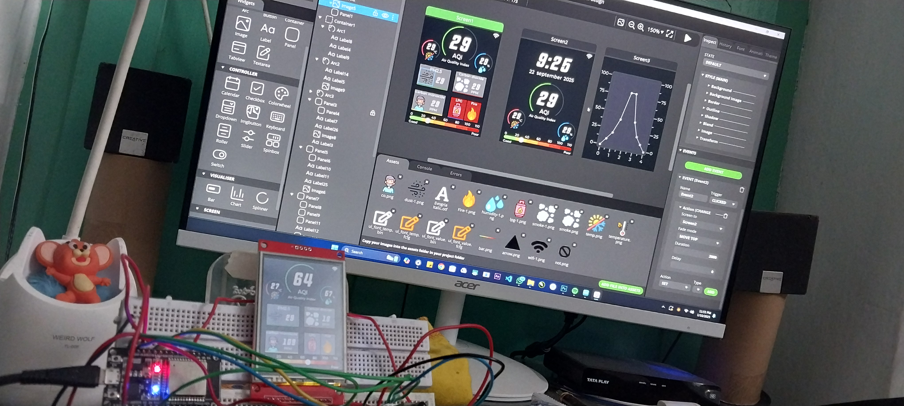
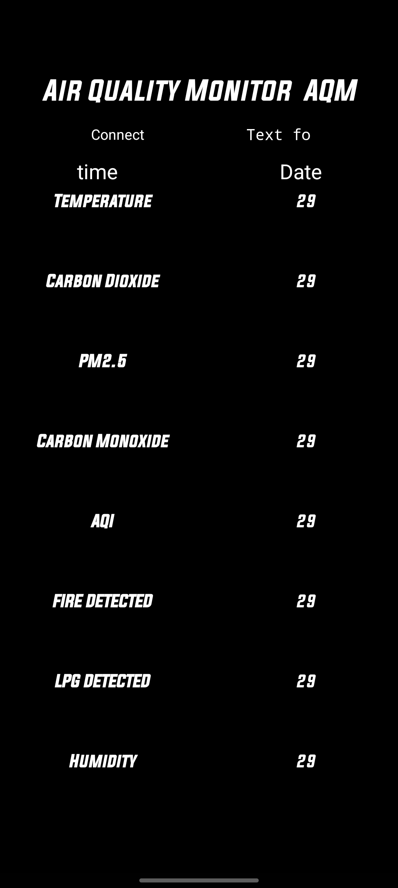
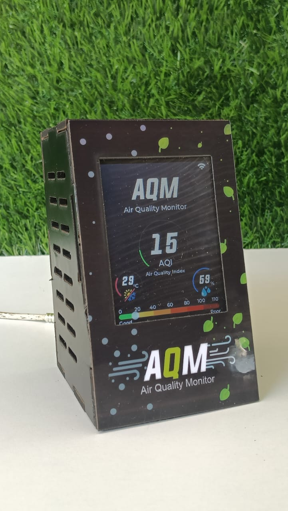
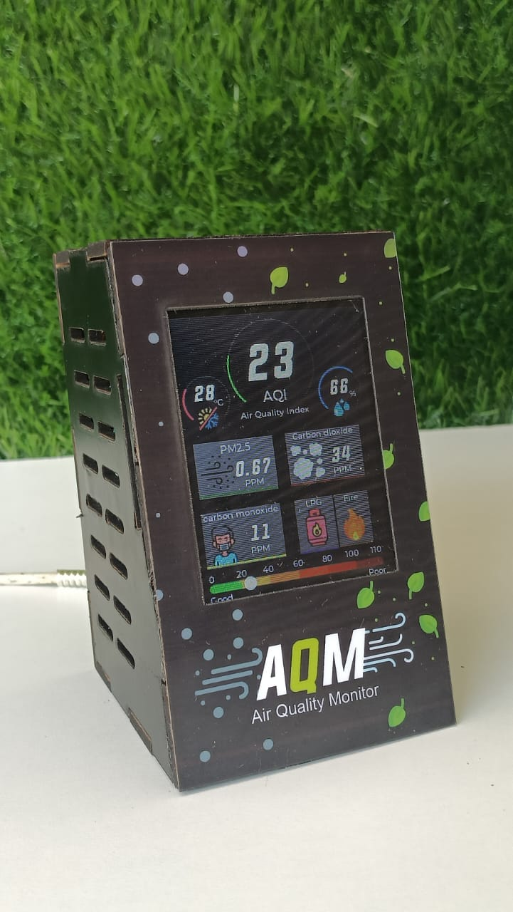

# 🌍 Smart Air Quality Monitoring System

### ESP32 + FreeRTOS + LVGL + Bluetooth

A **Smart IoT-based Air Quality Monitoring System** built using an **ESP32 microcontroller**, **ILI9341 TFT touchscreen**, and multiple environmental sensors.

The system continuously monitors:

* 🌡 Temperature
* 💧 Humidity
* ☁ Carbon Monoxide (CO)
* 💨 LPG Gas
* 🌫 PM2.5 Dust Density
* 🔥 Fire Detection

Sensor readings are displayed on a **modern graphical dashboard built with LVGL**.
The firmware is implemented using **FreeRTOS multitasking**, enabling efficient real-time operation.

Additionally, the ESP32 transmits live sensor data via **Bluetooth** to a smartphone or PC for remote monitoring.

---

# ✨ Features

* 🌡 **Temperature & Humidity Monitoring** using DHT11
* 💨 **LPG Gas Detection** using MQ2
* ☁ **Carbon Monoxide Detection** using MQ7
* 🌫 **Dust Density (PM2.5) Monitoring** using GP2Y1010 sensor
* 🔥 **Fire Detection with audible alarm**
* 📊 **Real-time graphical dashboard using LVGL**
* 👆 **Touchscreen interface for screen navigation**
* 📱 **Bluetooth data transmission** to smartphone/PC
* ⚠️ **Visual + sound alerts for dangerous conditions**
* ⚡ **FreeRTOS multitasking architecture**

---

# 🧠 FreeRTOS System Architecture

The firmware uses **FreeRTOS tasks** to run multiple operations concurrently.

| Task               | Function                                             |
| ------------------ | ---------------------------------------------------- |
| **GUI Task**       | Handles LVGL display rendering and touchscreen input |
| **Sensor Task**    | Reads sensor data (DHT11, MQ7, MQ2, Dust sensor)     |
| **Alarm Task**     | Monitors fire and LPG sensors and activates buzzer   |
| **Bluetooth Task** | Sends real-time sensor data via Bluetooth            |

### Task Priority Design

| Task           | Priority | Reason                   |
| -------------- | -------- | ------------------------ |
| Alarm Task     | High     | Safety critical          |
| Sensor Task    | Medium   | Periodic sensor readings |
| GUI Task       | Medium   | UI updates               |
| Bluetooth Task | Low      | Background communication |

This architecture ensures **critical events are handled immediately**.

---

# 🧩 Hardware Components

| Component           | Description                   |
| ------------------- | ----------------------------- |
| ESP32 Dev Module    | Main microcontroller          |
| DHT11               | Temperature & Humidity sensor |
| MQ2                 | LPG Gas detection             |
| MQ7                 | Carbon monoxide sensor        |
| GP2Y1010            | Dust / PM2.5 sensor           |
| IR Fire Sensor      | Flame detection               |
| Buzzer              | Alarm for gas/fire            |
| ILI9341 TFT Display | 240×320 touchscreen display   |
| LVGL Library        | Graphical user interface      |
| FreeRTOS            | Real-time multitasking        |

---

# ⚙️ Working Principle

### 1️⃣ Sensor Data Acquisition

The ESP32 collects environmental data from:

* DHT11 → Temperature & Humidity
* MQ7 → Carbon Monoxide
* MQ2 → LPG Gas
* GP2Y1010 → Dust density
* IR Sensor → Fire detection

---

### 2️⃣ Data Visualization

The **LVGL GUI dashboard** displays data using:

* Labels for numerical values
* Arc gauges for temperature and humidity
* Sliders representing air quality

Touch input allows navigation between different UI screens.

---

### 3️⃣ Safety Monitoring

The **Alarm Task** constantly monitors gas and fire sensors.

If danger is detected:

* The **buzzer activates**
* The **alert panel changes color on the display**

---

### 4️⃣ Bluetooth Data Transmission

Sensor data is transmitted using Bluetooth in the format:

Temperature,Humidity,CO_ppm,DustDensity,FireStatus

Example:

28.7,65.4,2.4,0.12,Yes

Data can be viewed using:

* Bluetooth Terminal apps
* Custom mobile IoT applications

---

# 🔌 ESP32 Pin Configuration

| Sensor/Module   | ESP32 Pin               |
| --------------- | ----------------------- |
| DHT11           | GPIO 27                 |
| Fire Sensor     | GPIO 14                 |
| Buzzer          | GPIO 33                 |
| MQ2 (LPG)       | GPIO 13                 |
| MQ7 (CO)        | GPIO 34                 |
| Dust Sensor LED | GPIO 13                 |
| TFT Display     | Configured via TFT_eSPI |

---

# 🖼️ Project Images

## Hardware Setup

|     ESP32 Setup     |         Sensors         |
| :-----------------: | :---------------------: |
|  |  |

---

## Display Screens

|        Home Screen        |         Alert Screen        |
| :-----------------------: | :-------------------------: |
|  |  |

---

# 🎥 Demo Video

Watch the project demonstration:

Demo1.mp4

---

# 🧠 Applications

* Smart Home Air Quality Monitoring
* Industrial Gas Leak Detection
* Fire Safety Systems
* IoT Environmental Monitoring
* Smart Buildings
* Greenhouse Monitoring
* Embedded Systems Educational Projects

---

# 👨‍💻 Author

**Harsha Vardhana Raju**

🎓 Electrical & Electronics Engineering
Swarnandra Institute of Engineering and Technology

📧 [raju2292003@gmail.com](mailto:raju2292003@gmail.com)

---
